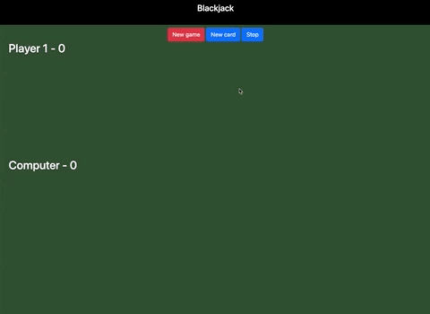

# 🃏 21 Blackjack

Here is a quick BlackJack game implementation for two players (user and computer) in JavaScript using the Underscore library, some Bootstrap and JS Minifier.

### Game instructions

The goal is to reach 21 points or at least stay as close as possible to that score.
Starts Player 1 who receives as many cards as user wants by clicking on the "New card" button. As well, the player can stop his game through the "Stop" button which will mean is passing the turn to the computer.

## Table of contents

- [Overview](#overview)
  - [The challenge](#the-challenge)
  - [Wireframes](#wireframes)
  - [Links](#links)
- [My process](#my-process)
  - [Built with](#built-with)
  - [What I learned](#what-i-learned)
- [Author](#author)

## Overview

### The challenge

- Building out the 52 card deck automatically associating images to values and figures.

- Shuffling the deck so that in each new game they have a different order.

- Create the 2 players. For each player I keep track its "id" and their current score.

- Check for winner evaluates whether any of the players has reached, approaches or exceeds 21 points. It compares the scores of both players and determines who wins, loses or if there is a tie.

- Modal. Depending on the winner shows a modal window with a specific message and emoji for it. Also changes the color of the score on the mat all modifying the DOM.

- Refactor code.

- Create a Module Pattern to encapsulate all the application logic of the game and make all the variables and functions only be visible inside the module.

### Wireframes

### Links

- Code: [https://github1s.com/albavidalm/21-blackjack](https://github1s.com/albavidalm/21-blackjack)
- Live: [https://albavidalm.github.io/21-blackjack/](https://albavidalm.github.io/21-blackjack/)

## My process

### Built with

- HTML5
- CSS3
- Bootstrap
- JavaScript
- Underscore

### What I learned

This is the first time I use the Underscore library and a Pattern Module.

## Author

- GitHub: [https://github.com/albavidalm](https://github.com/albavidalm)
- Email: [albavidalm @ gmail.com](mailto:albavidalm@gmail.com?subject=Hi)
- Linkedin: [https://www.linkedin.com/in/albavidalm/](https://www.linkedin.com/in/albavidalm/)

## 🖤 Support

Sharing is caring, contributions and suggestions are always welcome.
